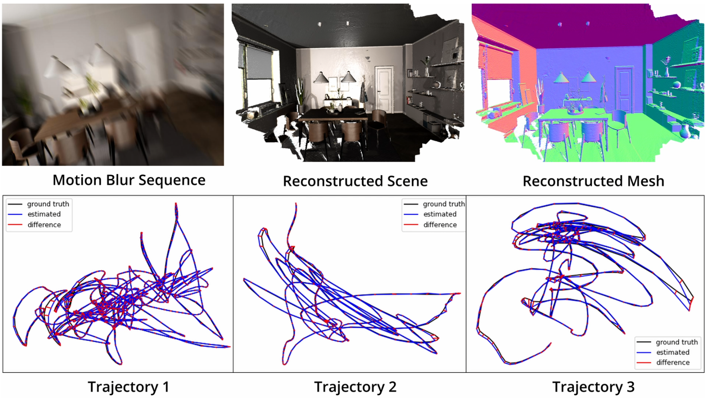

<h1 align=center font-weight:100> <strong><i>MBA-SLAM</i></strong>: Motion Blur Aware Dense Visual SLAM with Radiance Fields Representation</h1>

<h3 align="center">arXiv 2024</h3>

<h5 align="center">

## Overview

    

Given a sequence of severe motion blurred images and depth, MBA-SLAM can accurately estimate the local camera motion trajectory of each blurred image within the exposure time and recovers the high quality 3D scene. It surpasses prior vSLAMs on both sharp datasets and motion blurred datasets.

## Pipeline

    

<b>Tracking:</b> Given the current blurry frame, the mapper first renders a virtual sharp image of the lastest blurry keyframe from the 3D scene. Our motion blur-aware tracker directly estimates the camera motion trajectory during the exposure time. <b>Mapping:</b> Our mapper generates virtual sharp images along the camera trajectory, following the standard rendering procedures of Radiance Fields or Gaussian Splatting. The blurry image can then be synthesized by averaging these virtual images, adhering to the physical image formation model of motion-blurred images.